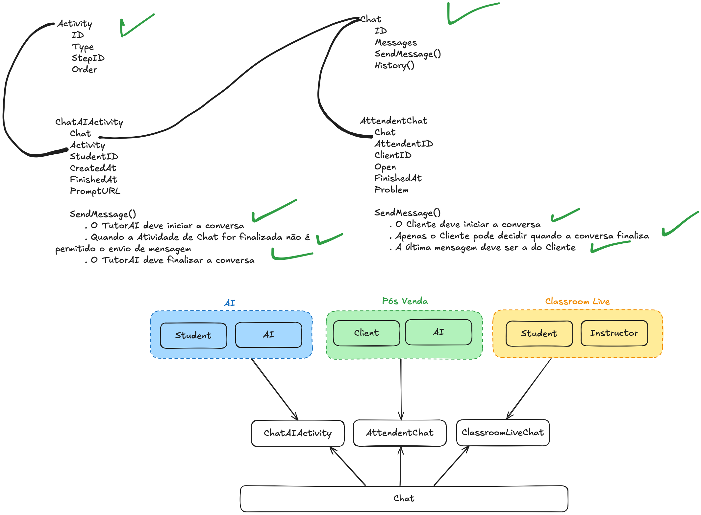

# Talk To Me

**POC** para validar conceitos voltados ao **negócio** e como é possível **expandir para a necessidade** de cada projeto.
Nesse caso, a implementação de um `Chat` que é uma Conversa que possuí a funcionalidade de `SendMessage` e `History`.

Com o `Chat` foi possível estender esse conceito e utilizar em outras necessidades como:

- `ChatActivity` que é uma Atividade com um TutorAI para o time Educational
- `ChatAttendant` que é um ChatBot que da suporte ao Cliente de Pós venda]



Para rodar o projeto é necessário

- É necessário de uma **OpenAI Key** e adicionar como variável `ai/ai.go`
- go run *.go

Existem testes de unidade que validam algumas das regras do negócio

```shell
$ go test -v ./...
```
